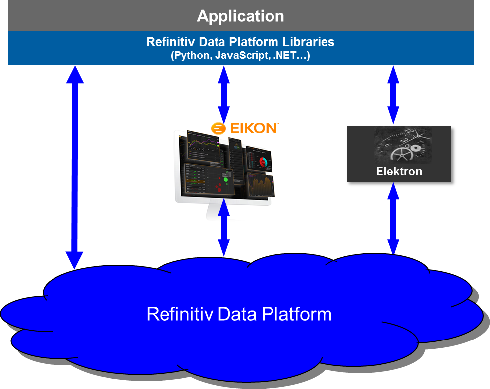
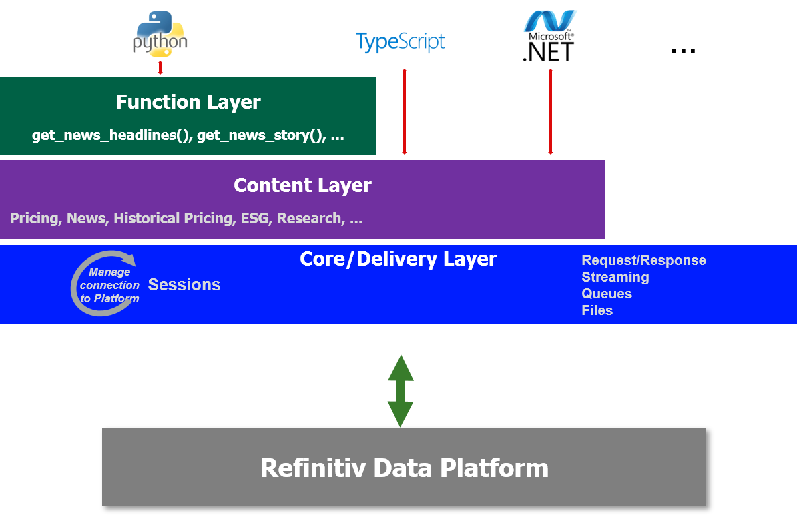
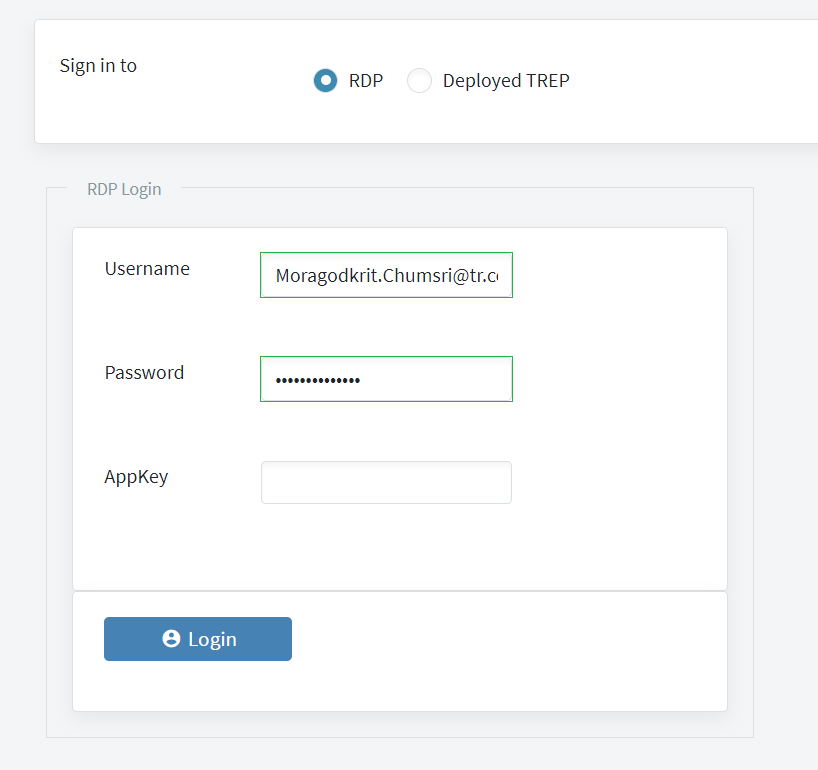
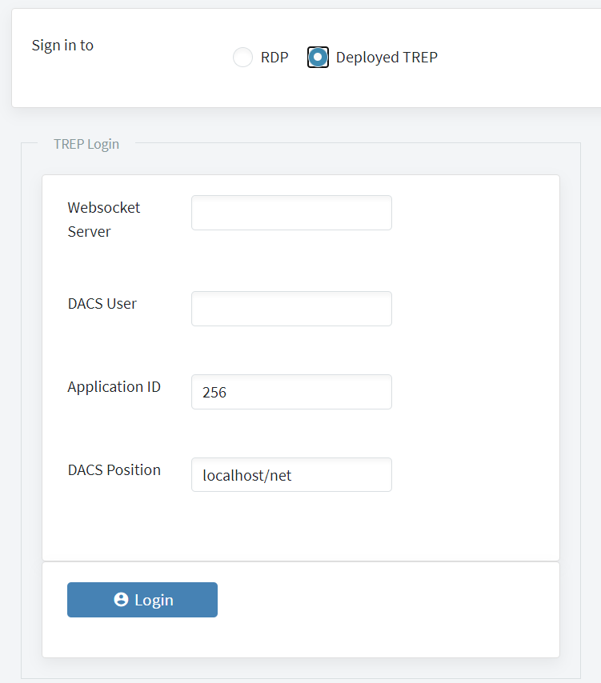
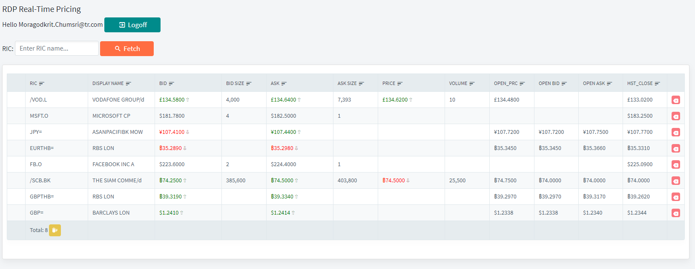
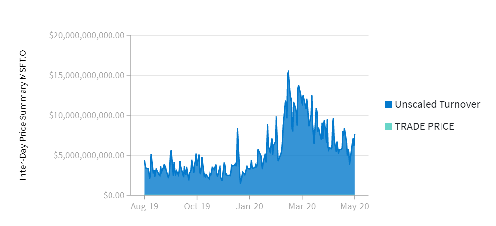
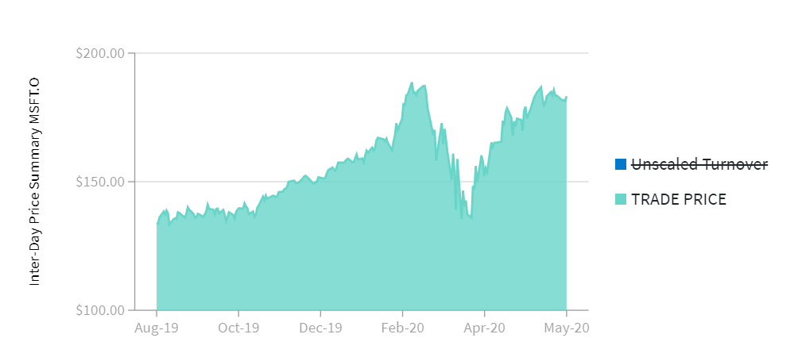
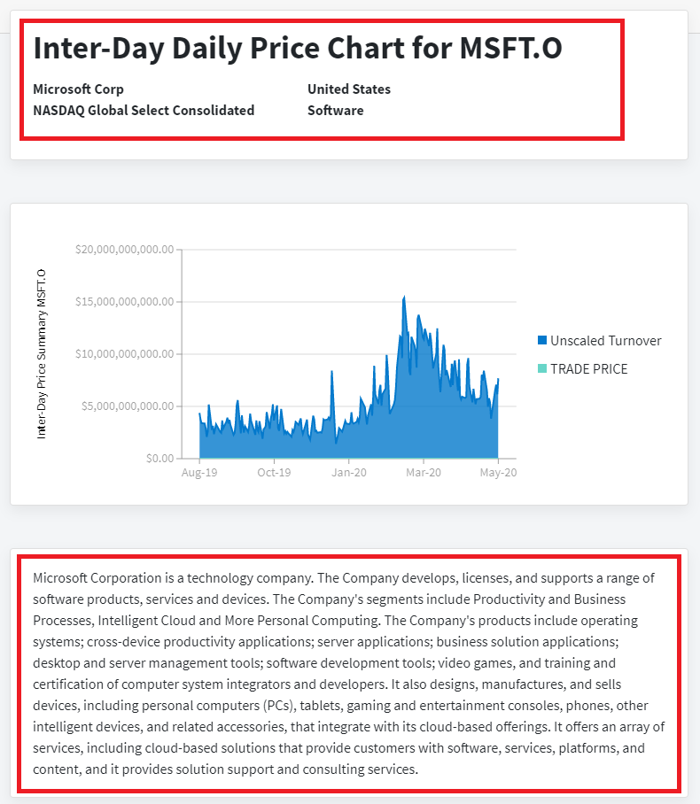
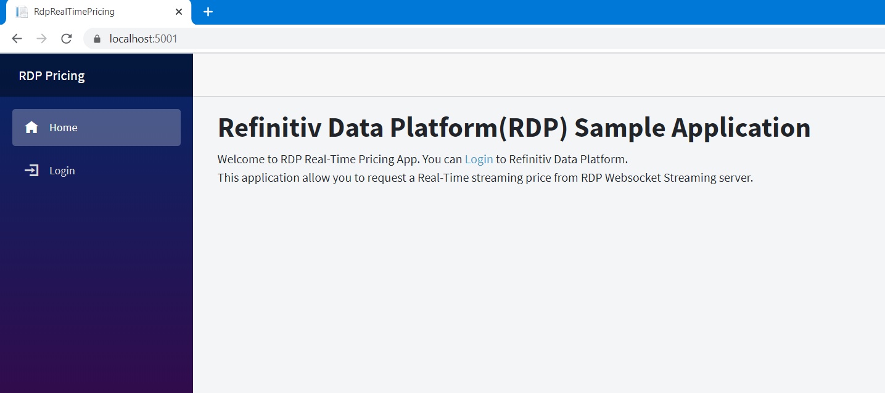
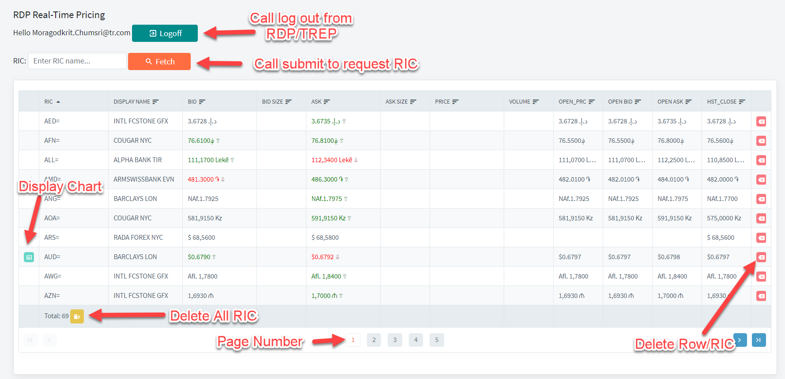

# Displays stock price in real-time on the web using ASP.NET Core Blazor and RDP.NET

It's been a while we receive a question from a developer in .NET Ecosystem regarding a cross-platform solution to help develop an [ASP.NET Core](https://docs.microsoft.com/en-us/aspnet/core/?view=aspnetcore-3.1) web application and service. The developer wants to integrate a real-time stream of market price data from local deployed TREP or [Refinitiv Data Platform(RDP)](https://developers.refinitiv.com/refinitiv-data-platform/)/Elektron Real-Time(ERT) in Cloud streaming services to their web application for viewing or stock trading purpose. Because currently, the library we have so far that are Elektron SDK, and RFA.NET does not have a .NET standard library, which can be used with such kind of .NET Core web application. Fortunately, the ERT in Cloud and TREP (version 3.2.x and later version) provide a WebSocket connection that supports a market price streaming and also supports another domain model data available on Elektron for Real-Time as well. Software developers can use any WebSocket client library to establish a connection and communicate with the WebSocket server directly. Also, the user can leverage functionality from [Refinitiv Data Platform(RDP)](https://developers.refinitiv.com/refinitiv-data-platform/refinitiv-data-platform-apis) HTTP endpoints to get additional data such as Historical Summary and Company details.

The Refinitiv Data Platform Libraries for .NET (RDP.NET) is one of the solutions for this kind of .NET Core project, and it's a new community-based library that is designed as ease-of-use interfaces. It can help eliminate the development process complexity. The library implemented a WebSocket connection inside; therefore, it is supporting retrieving the market price streaming from the ERT in the cloud. And it also provides additional functionality to get data from other RDP endpoints. The below picture depicts the architecture of RDP Libraries.



And the following picture is an architecture and layers from the Libraries.



The RDP.NET are ease-of-use APIs defining a set of uniform interfaces providing the developer access to the Refinitiv Data Platform and Elektron. The APIs are designed to provide consistent access through multiple access channels; developers can choose to access content from the desktop, through their deployed streaming services or directly to the cloud. The interfaces encompass a set of unified Web APIs providing access to both streaming (over WebSockets) and non-streaming (HTTP REST) data available within the platform.

This article will provide an example web application which creates by using [ASP.NET Core Blazor Framework](https://dotnet.microsoft.com/apps/aspnet/web-apps/blazor). The sample web application is a server-side Blazor web application that can be used with C# to provide interactive web UI.  In this project, we will use the RDP.NET library to login to RDP or TREP server and then retrieving market price data from local deployed TREP or ERT in Cloud. The sample application will use the functionality of the Core/Delivery Layer, to request streaming data, especially real-time prices. Moreover, the app also uses RDP Historical Pricing API to request Inter day Summaries for end of day daily data. It also uses the RDP Company Overview Service API to get the company information of the RIC and display it along with the Chart of the Inter day data.


The sample ASP.NET Blazor app will use [Radzen Blazor component](https://blazor.radzen.com/) which is a free Blazor Component Library to create the UI to get a login, displays a Stock price and plot a Chart. [Radzen Blazor Components](https://blazor.radzen.com/get-started) are free for commercial use. You can install them from NuGet without registration. The components are implemented in C# and take full advantage of the [Blazor framework](https://docs.microsoft.com/en-us/aspnet/core/blazor/get-started?view=aspnetcore-3.1&tabs=visual-studio). They do not depend on or wrap existing JavaScript frameworks or libraries. Both server-side and client-side (WASM) Blazor are supported.

## Prerequisites

* [.NET Core SDK 3.1(LTS)](https://dotnet.microsoft.com/download/dotnet-core) or higher.
* Visual Studio Code or [Visual Studio 2019](https://devblogs.microsoft.com/aspnet/blazor-webassembly-3-2-0-now-available/)(Ensure you have installed the latest release of Visual Studio 2019).
* Understand basic usage of Blazor application. You can read [Get Started guide](https://docs.microsoft.com/en-us/aspnet/core/blazor/?view=aspnetcore-3.1) from MSDN.
* Explorer [Radzen Blazor Component](https://blazor.radzen.com/)(You can install it via NuGet).
* Understand how to use Refinitiv Data Platform (RDP) Libraries for .NET. Please find the guide from [RDP Libraries for .NET document](https://developers.refinitiv.com/refinitiv-data-platform/refinitiv-data-platform-libraries/quick-start) on the developer portal.
* RDP Account with permission to get Real-Time Price. Or TREP Server with WebSocket enabled with a valid DACS user. Please ensure that you have permission to request InterDay Daily Summary data and a company details if you wish to use the app to generate area Chart.

## The main functionality of the Web application 

The web application supports the following functionalities. 

1) It can log on to the RDP server, or TREP depends on the network you host the web application.
2) It can request and display Real-Time Market Price updates from a WebSocket connection. 
3) It can request multiple RICs, and the user should be able to remove RIC from the list.
4) For the RDP account, you should be able to display area Chart for Interday Summary Daily price. 
5) For the RDP account, you should be able to view the company name and summary details.

Note that permission to view/access the information depends on your RDP or DACS account preference.

## Using RDP.NET in the application

Please read the article [Create MRN Real-Time News Story Consumer app using .NET Core and RDP.NET Library](https://developers.refinitiv.com/article/create-mrn-real-time-news-story-consumer-app-using-net-core-and-rdpnet-library) for the primary usage of RDP.NET API. I will not describe more about the necessary steps to use RDP.NET in this article. Also, I will apply the codes from the material to create a wrapper class along with the event handlers to process the events and messages from RDP.NET internal layer. 

This example has implemented two main wrapper classes to interact with RDP.NET Library.  The RdpSession class was created to maintain a Session and  RDPMarketPriceService was designed to handle the item stream. It uses RDP.NET Stream API to manage item streams for each RICs.

Below is a snippet of codes for the RdpSession class. I need to hide the implementation of some methods to make it short.

```c#
//...
using Refinitiv.DataPlatform;
using Refinitiv.DataPlatform.Core;

namespace RdpRealTimePricing.ViewModel
{
    public class RdpSession
    {

        #region TREPCredential
        public  string TrepUsername = "";
        public string TrepAppid = "256";
        public string TrepPosition = "localhost/net";
        public string WebSocketHost = "";
        #endregion

        #region RDPUserCredential
        public string RdpUser = "";
        public string RdpPassword = "";
        public string RdpAppKey = "";
  
        #endregion

        private ISession _session;
        internal ISession ServiceSession => _session != null
                ? _session
                : throw new Exception("Please call InitWebSocketConnectionAsync to initialize RdpSession ");
        //IStream stream;
        public Session.State SessionState { get; internal set; }
        public bool IsLoggedIn { get; set; }

        public RdpSession()
        {
          ...
        }

        public void CloseSession()
        {
           ...
        }
        public Task InitWebSocketConnectionAsync(bool useRdp)
        {
            return Task.Run(() =>
            {
                Log.Level = NLog.LogLevel.Off;

                if (!useRdp)
                {
                    _session = CoreFactory.CreateSession(new DeployedPlatformSession.Params()
                        .Host(WebSocketHost)
                        .WithDacsUserName(TrepUsername)
                        .WithDacsApplicationID(TrepAppid)
                        .WithDacsPosition(TrepPosition)
                        .OnState(processOnState)
                        .OnEvent(processOnEvent));
                }
                else
                {
                    System.Console.WriteLine("Start RDP PlatformSession");
                    _session = CoreFactory.CreateSession(new PlatformSession.Params()
                        .OAuthGrantType(new GrantPassword().UserName(RdpUser)
                            .Password(RdpPassword))
                        .AppKey(RdpAppKey)
                        .WithTakeSignonControl(true)
                        .OnState(processOnState)
                        .OnEvent(processOnEvent));
                }
                _session.OpenAsync().ConfigureAwait(false);

            });
        }
        private void processOnEvent(ISession session, Session.EventCode code, JObject message){...}
        private void processOnState(ISession session, Session.State state, string message){...}
        public event EventHandler<OnStateChangedEventArgs> OnStateChangedEvents;
        public event EventHandler<OnSessionEventArgs> OnSessionEvents;

        protected void RaiseStateChanged(Session.State state, string message){...}
        protected virtual void OnStateChanged(OnStateChangedEventArgs e){...}
        protected void RaiseSessionEvent(Session.EventCode code, JObject message){...}
        protected virtual void OnSessionEvent(OnSessionEventArgs e){...}
    }
}
```
The next one is a class RdpMarketPriceService, which is the main class to process messages. It takes responsible for deserializing data from JSON message to a model class that contains only the fields required by the Web application to display stock price in the RadZenGrid component. It also uses ConcurrentDictionary to create an internal cache to hold the Stream for each item. The OpenItemAsync require a field list from Model class to send field list with the item request. So it needs to iterate through the JSON Property Name of the Model class to get a list of field names. 

We need only the fields we interest, and then we can set the field names in the view of the request message to reduce the size of the message and network bandwidth.

```c#

namespace RdpRealTimePricing.ViewModel
{
    public class RdpMarketPriceService
    {
        private readonly ConcurrentDictionary<string, IStream> _streamCache;
        public async Task OpenItemAsync(string item, Refinitiv.DataPlatform.Core.ISession RdpSession,Type modelType)
        {
           var fieldnameList = modelType.GetProperties()
                    .SelectMany(p => p.GetCustomAttributes(typeof(JsonPropertyAttribute))
                        .Cast<JsonPropertyAttribute>())
                    .Select(prop => prop.PropertyName)
                    .ToArray();

            if (RdpSession != null)
                await Task.Run(() =>
                {
                    ItemStream.Params itemParams;
                    if (!fieldnameList.Any())
                    {
                        // First, prepare our item stream details including the fields of interest and where to capture events...
                        itemParams = new ItemStream.Params().Session(RdpSession)
                            .OnRefresh(processOnRefresh)
                            .OnUpdate(processOnUpdate)
                            .OnStatus(processOnStatus);
                    }
                    else
                    {
                        // First, prepare our item stream details including the fields of interest and where to capture events...
                        itemParams = new ItemStream.Params().Session(RdpSession)
                            .WithFields(fieldnameList)
                            .OnRefresh(processOnRefresh)
                            .OnUpdate(processOnUpdate)
                            .OnStatus(processOnStatus);
                    }

                    var stream = DeliveryFactory.CreateStream(itemParams.Name(item));
                    if (_streamCache.TryAdd(item, stream))
                    {
                        stream.OpenAsync();
                    }
                    else
                    {
                        var msg = $"Unable to open new stream for item {item}.";
                        RaiseOnError(msg);
                    }
                });
            else
                throw new ArgumentNullException("RDP Session is null.");
        }

        public RdpMarketPriceService()
        {
            _streamCache = new ConcurrentDictionary<string, IStream>();
        }
        public Task CloseItemStreamAsync(string item)
        {
            return Task.WhenAll(Task.Run(() =>
            {
                if (_streamCache.TryGetValue(item,out var stream))
                {
                    stream.CloseAsync();
                    if (_streamCache.TryRemove(item, out var removedItem))
                    {
                        removedItem = null;
                    }
                }
            }));
        }

        /// Convert field list to MarketPriceData 
        public static MarketPriceData FieldListToMarketPriceData(Dictionary<string, dynamic> data)
        {...}

        /// Update content in destinatino MarketPriceData object with update fields from source
        public static void UpdateFieldListWithFieldUpdate(Dictionary<string,dynamic> source,ref MarketPriceData destination)
        {...}
       #region ItemEventProcessing
       private void processOnRefresh(IStream s, JObject msg){...}
       private void processOnUpdate(IStream s, JObject msg){...}
       private void processOnStatus(IStream s, JObject msg){...}
        #endregion
        // Event Handler
       #region EventHandler
       public event EventHandler<OnErrorEventArgs> OnErrorEvents;
       public event EventHandler<OnResponseMessageEventArgs> OnResponeMessageEvents;
       protected void RaiseOnMessage(MessageTypeEnum msgtype, IMessage message){...}
       protected virtual void OnRespMessage(OnResponseMessageEventArgs e){...}
       protected void RaiseOnError(string message){...}
       protected virtual void OnError(OnErrorEventArgs e){...}
        #endregion EventHandler
    }
}

```

Sample of MarketPriceData model class. You need to add JsonProperty tag to the property if you wish to add a new property to the model. The name of JSONProperty must be the same field name as field list from the Elektron Webosocket Market Price JSON response message.

```c#
namespace RdpRealTimePricing.Model.Data
{
    public class MarketPriceData
    {
        ...

        [Newtonsoft.Json.JsonProperty("DSPLY_NAME", DefaultValueHandling = DefaultValueHandling.Ignore,
            NullValueHandling = Newtonsoft.Json.NullValueHandling.Include)]
        public string DSPLY_NAME { get; set; }

        [Newtonsoft.Json.JsonProperty("TRDPRC_1", DefaultValueHandling = DefaultValueHandling.Ignore,
            NullValueHandling = Newtonsoft.Json.NullValueHandling.Include)]
        public double? TRDPRC_1{get;set;}
        
        [Newtonsoft.Json.JsonProperty("TRDVOL_1", DefaultValueHandling = DefaultValueHandling.Ignore,
            NullValueHandling = Newtonsoft.Json.NullValueHandling.Include)]
        public long? TRDVOL_1 { get; set; }

       
        [Newtonsoft.Json.JsonProperty("OPEN_PRC", DefaultValueHandling = DefaultValueHandling.Ignore,
            NullValueHandling = Newtonsoft.Json.NullValueHandling.Include)]
        public double? OPEN_PRC { get; set; }

        [Newtonsoft.Json.JsonProperty("HST_CLOSE", DefaultValueHandling = DefaultValueHandling.Ignore,
            NullValueHandling = Newtonsoft.Json.NullValueHandling.Include)]
        public double? HST_CLOSE { get; set; }

        ...
    }
```

Sample usage in the application layer.

```C#
MarketPriceData data = new MarketPriceData { RicName = itemname };
if (AppData.DataCache.TryAdd(itemname, data))
{
    await RdpMarketPriceService.OpenItemAsync(itemname, RdpSession.ServiceSession, typeof(MarketPriceData));
    ...
}
```

### __Create Blazor Login Page__

Once the web application is started, the user has to input either a valid RDP credential or a WebSocket Server with a valid DACS username for a TREP server. We need to create a Blazor Login page using the Radzen UI component to get the RDP or TREP login details from the user and pass it to RdpSession via its properties before calling InitWebSocketConnectionAsync.

ASP.NET Core supports the [dependency injection (DI)](https://docs.microsoft.com/en-us/aspnet/core/fundamentals/dependency-injection?view=aspnetcore-3.1) software design pattern, so first steps we need to add RdpSession, RdpMarketPriceService, and AppData to service scoped in Startup.cs. The AppData object holds the cache for the market price data with additional user state and status.

```c#
//Startup.cs
public void ConfigureServices(IServiceCollection services)
{
    ...
    services.AddScoped<RdpSession>();
    services.AddScoped<RdpMarketPriceService>();
    services.AddScoped<AppData>();
    ...
}
```
Then we can inject the object we need to use in the Razor page by calling the following codes at the beginning of the page like below snippet codes from Login.razor.

```c#
...
@page "/login"
@inject RdpSession RdpSession
@inject AppData AppData
@inject NavigationManager NavigationManager
...
```
After that, we can use RDPSession and AppData objects everywhere on the page. Below is a sample code we bind a login property for RDP and TREP login from RdpSession to RadZen text input.

```C#
...
@if (AppData.UseRDP)
{
    <div class="row">
        <div class="col-md-6 col-sm-12 p-4">
            <RadzenTemplateForm TItem="RdpSession" Data="@RdpSession" Submit="@OnSubmitAsync" Visible="LoginRdpVisible">
                <RadzenFieldset Text=@CheckBoxTxt>
                    <RadzenCard Visible="@LoginRdpVisible">
                        <div class="row" style="margin-bottom: 48px">
                            <div class="col-md-3 align-right">
                                <RadzenLabel Text="Username" />
                            </div>
                            <div class="col-md-9">
                                <RadzenTextBox style="display: block;" Name="UsernameTxt" @bind-Value="RdpSession.RdpUser" />
                                <RadzenRequiredValidator Component="UsernameTxt" Text="Username is required" Popup="true" Style="position: absolute" />
                            </div>
                        </div>
                        <div class="row" style="margin-bottom: 48px">
                            <div class="col-md-3">
                                <RadzenLabel Text="Password" />
                            </div>
                            <div class="col-md-9">
                                <RadzenPassword style="display: block" Name="PasswordTxt" @bind-Value="RdpSession.RdpPassword" />
                                <RadzenRequiredValidator Component="PasswordTxt" Text="Password is required" Popup="true" Style="position: absolute" />
                            </div>
                        </div>
                        <div class="row" style="margin-bottom: 48px">
                            <div class="col-md-3">
                                <RadzenLabel Text="AppKey" />
                            </div>
                            <div class="col-md-9">
                                <RadzenTextBox style="display: block" Name="AppKeyTxt" @bind-Value="RdpSession.RdpAppKey" />
                                <RadzenRequiredValidator Component="AppKeyTxt" Text="AppKey is required" Popup="true" Style="position: absolute" />
                            </div>
                        </div>
                    </RadzenCard>
                    <RadzenCard>
                        <RadzenButton ButtonType="ButtonType.Submit" Text="Login" Icon="account_circle" Style="margin-bottom: 20px; width: 150px; background-color: steelblue" />
                    </RadzenCard>
                </RadzenFieldset>

                <RadzenProgressBar Value="100" Visible="@ProgressVisible" ShowValue="false" Mode="ProgressBarMode.Indeterminate" Style="margin-bottom: 20px" />
            </RadzenTemplateForm>
        </div>
    </div>
}
else
{
    <div class="row">
        <div class="col-md-6 col-sm-12 p-4">
            <RadzenTemplateForm TItem="RdpSession" Data="@RdpSession" Submit="@OnSubmitAsync" Visible="@(!LoginRdpVisible)">
                <RadzenFieldset Text=@CheckBoxTxt>
                    <RadzenCard Visible="@(!LoginRdpVisible)">
                        <div class="row" style="margin-bottom: 48px">
                            <div class="col-md-3 align-right">
                                <RadzenLabel Text="Websocket Server" />
                            </div>
                            <div class="col-md-9">
                                <RadzenTextBox style="display: block;" Name="WsServerUri" @bind-Value="RdpSession.WebSocketHost" />
                                <RadzenRequiredValidator Component="WsServerUri" Text="Websokcet Host is required. eg: wsserver:15000" Popup="true" Style="position: absolute" />
                            </div>
                        </div>
                        <div class="row" style="margin-bottom: 48px">
                            <div class="col-md-3 align-right">
                                <RadzenLabel Text="DACS User" />
                            </div>
                            <div class="col-md-9">
                                <RadzenTextBox style="display: block;" Name="TrepUserTxt" @bind-Value="RdpSession.TrepUsername" />
                                <RadzenRequiredValidator Component="TrepUserTxt" Text="DACS User is required" Popup="true" Style="position: absolute" />
                            </div>
                        </div>
                        <div class="row" style="margin-bottom: 48px">
                            <div class="col-md-3">
                                <RadzenLabel Text="Application ID" />
                            </div>
                            <div class="col-md-9">
                                <RadzenTextBox style="display: block" Name="AppIdTxt" Placeholder="Optional. 256 is default." @bind-Value="RdpSession.TrepAppid" />
                            </div>
                        </div>
                        <div class="row" style="margin-bottom: 48px">
                            <div class="col-md-3">
                                <RadzenLabel Text="DACS Position" />
                            </div>
                            <div class="col-md-9">
                                <RadzenTextBox style="display: block" Name="DACSPositionTxt" @bind-Value="RdpSession.TrepPosition" />
                            </div>
                        </div>
                    </RadzenCard>
                    <RadzenCard>
                        <RadzenButton ButtonType="ButtonType.Submit" Text="Login" Icon="account_circle" Style="margin-bottom: 20px; width: 150px; background-color: steelblue" />
                    </RadzenCard>
                </RadzenFieldset>

                <RadzenProgressBar Value="100" Visible="@ProgressVisible" ShowValue="false" Mode="ProgressBarMode.Indeterminate" Style="margin-bottom: 20px" />
            </RadzenTemplateForm>
        </div>
    </div>
} 
@code
{
    //Codes to handle UI and callback
}          
```
Sample UI generated for RDP Login



Sample UI generated for TREP Login



Once the user clicks the Login button, it will call a method defined under @code block. Below is a callback method OnSubmitAsync that login to the server by using method InitWebSocketConnectionAsync. There are callback messages returned to the OnSession callback function and we can define the action based on the Session EventCode. For instance, if Login is a success, the application will navigate the user to page named "marketpricerate" which is the main page to shows UI for getting input RIC and display stock prices.

```c#
Task OnSubmitAsync()
{
    LoginReadOnly = true;
    ProgressVisible = true;
    this?.InvokeAsync(StateHasChanged);
    return RdpSession.InitWebSocketConnectionAsync(AppData.UseRDP);

}

...

 private async void OnSession(object o, OnSessionEventArgs e)
            {
                DialogRespType = $"{e.EventCode}";
                switch (e.EventCode)
                {
                    case Session.EventCode.SessionAuthenticationSuccess:
                    case Session.EventCode.StreamAuthenticationSuccess:
                    case Session.EventCode.StreamConnected:
                        {
                            if (RdpSession != null)
                            {
                                // Set Login Status
                            }

                            // Show Login success notification
                            NavigationManager.NavigateTo("marketpricerate");
                        }
                        break;
                    case Session.EventCode.SessionAuthenticationFailed:
                        {
                            // Show Authentication Failed Message
                        }
                        break;
                    default:
                        {
                            // Notify Error message
                            break;
                        }
                }
            }

....
```

### __Create Page to display Real-Time Stock Price__

Next step we need to create the main Razor page which is a page alias named "marketpricerate" which I talked earlier. This page takes responsible to get input RIC and submit a request to the server and then process the response message to displaying the Price update in the Radzen DataGrid table or showing an error like permission error, RIC not found, etc.

There is a Razor page named MarketPriceRate.razor from the [GitHub](https://github.com/Refinitiv-API-Samples/Example.RDP.NET.RdpRealTimePricing.git) repository for this project. Same as the Login.razor, you have to inject RdpSession, AppData, and RdpMarketPriceService at the beginning of the page, so you can use it every place on this page. 

```C#
@inject RdpSession RdpSession
@inject RdpMarketPriceService RdpMarketPriceService
@inject AppData AppData
```

RdpMarketPriceService is a class that takes the main responsible for requesting items and managing item callback. The following screenshot and Radzen UI codes are the main design of the Razor page.




It was generated by using the following RadZen UI.

```c#
<h3>RDP Real-Time Pricing </h3>

<div class="row">
    <div class="col-md-12">
        Hello @(AppData.CurrentUserName) <RadzenButton Click="@((args) => Click(args, "LogoffBtn"))" Text="Logoff" Icon="exit_to_app" Style="margin-bottom: 20px;  background-color: darkcyan" />
    </div>
</div>

<div class="row">

    <div class="col-md-12">
        RIC: <RadzenTextBox Placeholder="Enter RIC name..." @bind-Value="InputRics" Style="margin-bottom: 20px;" />
        <RadzenButton Click="@((args) => Click(args, "FetchBtn"))" Text="Fetch" Icon="search" Style="margin-bottom: 20px;" />
    </div>
</div>

<div class="row">
    <div class="col-md-12">
        <RadzenCard>
            <div class="row">

                <RadzenGrid AllowFiltering="false" FilterCaseSensitivity="FilterCaseSensitivity.Default" AllowPaging="true"
                            AllowSorting="true" Data="AppData.DataCache.Values.ToList<MarketPriceData>()" TItem="MarketPriceData" RowSelect="data => OnRowSelect(data)" ColumnWidth="100px;">
                    <Columns>
                        <div class="col-md-1">
                            <RadzenGridColumn TItem="MarketPriceData" Context="item" Bubble="true" Filterable="false" Sortable="false" TextAlign="TextAlign.Center" Width="40px">
                                <Template Context="item">
                                    <RadzenButton ButtonStyle="ButtonStyle.Info" Icon="insert_chart_outlined" Size="ButtonSize.Small" Click=@((args) => ShowChart(item)) Visible="@item.IsSelected" data-toggle="tooltip" data-placement="top" title="Display Chart" />
                                </Template>
                            </RadzenGridColumn>
                        </div>
                        <div class="col-md-1">
                            <RadzenGridColumn TItem="MarketPriceData" Property="RicName" Title="RIC" Width="140px">
                                <FooterTemplate>

                                    @if (AppData.DataCache.Keys.Any())
                                            {
                                    <span>Total:</span>  @string.Format($"{AppData.DataCache.Keys.Count}")
                                    <RadzenButton ButtonStyle="ButtonStyle.Warning" Icon="delete_sweep" Size="ButtonSize.Small" Click=@((args) => RemoveItem(null)) data-toggle="tooltip" data-placement="top" title="Remove all RIC" />
                                            }

                                </FooterTemplate>

                            </RadzenGridColumn>
                        </div>
                        <div class="col-md-1">
                            <RadzenGridColumn TItem="MarketPriceData" Property="DSPLY_NAME" Title="Display Name" Width="150px">
                                <Template Context="data">
                                    <label data-toggle="tooltip" data-placement="top" title=@data.DSPLY_NAME>@data.DSPLY_NAME</label>
                                </Template>
                            </RadzenGridColumn>
                        </div>
                        <div class="col-md-1">
                            <RadzenGridColumn TItem="MarketPriceData" Property="BID" Title="BID" Filterable="false" Width="150px">
                                <Template Context="data">
                                    <span style='color: @(GetFontColor(data.BID_Status))'>@ObjectExtensions.FormatCurrency(data.BID, data.CURRENCY)</span>
                                    @if (data.BID_Status == MarketPriceData.PriceChangeEnum.Up)
                                            {
                                    <span style='color: forestgreen'>&#8679;</span>
                                            }
                                            else if (data.BID_Status == MarketPriceData.PriceChangeEnum.Down)
                                            {
                                    <span style='color: darkred'>&#8681;</span>
                                            }
                                </Template>
                            </RadzenGridColumn>
                        </div>
                        <div class="col-md-1">
                            <RadzenGridColumn TItem="MarketPriceData" Property="BIDSIZE" Title="Bid Size" Filterable="false">
                                <Template Context="data">
                                    @String.Format(@"{0:#,##0}", data.BIDSIZE)
                                </Template>
                            </RadzenGridColumn>
                        </div>
                        <div class="col-md-1">
                            <RadzenGridColumn TItem="MarketPriceData" Property="ASK" Title="ASK" Filterable="false" Width="150px">
                                <Template Context="data">
                                    <span style='color: @(GetFontColor(data.ASK_Status))'>@ObjectExtensions.FormatCurrency(data.ASK, data.CURRENCY)</span>
                                    @if (data.ASK_Status == MarketPriceData.PriceChangeEnum.Up)
                                            {
                                    <span style='color: forestgreen'>&#8679;</span>
                                            }
                                            else if (data.ASK_Status == MarketPriceData.PriceChangeEnum.Down)
                                            {
                                    <span style='color: darkred'>&#8681;</span>
                                            }
                                </Template>
                            </RadzenGridColumn>
                        </div>
                        <div class="col-md-1">
                            <RadzenGridColumn TItem="MarketPriceData" Property="ASKSIZE" Title="ASK Size" Filterable="false">
                                <Template Context="data">
                                    @String.Format("{0:#,##0}", data.ASKSIZE)
                                </Template>
                            </RadzenGridColumn>
                        </div>
                        <div class="col-md-1">
                            <RadzenGridColumn TItem="MarketPriceData" Property="TRDPRC_1" Title="Price" Filterable="false" Width="150px">
                                <Template Context="data">
                                    <span style='color: @(GetFontColor(data.TRDPRC_1_Status))'>@ObjectExtensions.FormatCurrency(data.TRDPRC_1, data.CURRENCY)</span>
                                    @if (data.TRDPRC_1_Status == MarketPriceData.PriceChangeEnum.Up)
                                            {
                                    <span style='color: forestgreen'>&#8679;</span>
                                            }
                                            else if (data.TRDPRC_1_Status == MarketPriceData.PriceChangeEnum.Down)
                                            {
                                    <span style='color: darkred'>&#8681;</span>
                                            }
                                </Template>
                            </RadzenGridColumn>
                        </div>
                        <div class="col-md-1">
                            <RadzenGridColumn TItem="MarketPriceData" Property="TRDVOL_1" Title="Volume" Filterable="false">
                                <Template Context="data">
                                    @String.Format("{0:#,##0}", data.TRDVOL_1)
                                </Template>
                            </RadzenGridColumn>
                        </div>
                        <div class="col-md-1">
                            <RadzenGridColumn TItem="MarketPriceData" Property="OPEN_PRC" Title="OPEN_PRC" Filterable="false">
                                <Template Context="data">
                                    @ObjectExtensions.FormatCurrency(data.OPEN_PRC, data.CURRENCY)
                                </Template>
                            </RadzenGridColumn>
                        </div>
                        <div class="col-md-1">
                            <RadzenGridColumn TItem="MarketPriceData" Property="OPEN_BID" Title="Open Bid" Filterable="false">
                                <Template Context="data">
                                    @ObjectExtensions.FormatCurrency(data.OPEN_BID, data.CURRENCY)
                                </Template>
                            </RadzenGridColumn>
                        </div>
                        <div class="col-md-1">
                            <RadzenGridColumn TItem="MarketPriceData" Property="OPEN_ASK" Title="Open Ask" Filterable="false">
                                <Template Context="data">
                                    @ObjectExtensions.FormatCurrency(data.OPEN_ASK, data.CURRENCY)
                                </Template>
                            </RadzenGridColumn>
                        </div>
                        <div class="col-md-1">
                            <RadzenGridColumn TItem="MarketPriceData" Property="HST_CLOSE" Title="HST_CLOSE" Filterable="false">
                                <Template Context="data">
                                    @ObjectExtensions.FormatCurrency(data.HST_CLOSE, data.CURRENCY)
                                </Template>
                            </RadzenGridColumn>
                        </div>
                        <div class="col-md-1">
                            <RadzenGridColumn TItem="MarketPriceData" Context="item" Bubble="false" Filterable="false" Sortable="false" TextAlign="TextAlign.Center" Width="40px">
                                <Template Context="item">
                                    <RadzenButton ButtonStyle="ButtonStyle.Danger" Icon="backspace" Size="ButtonSize.Small" Click=@((args) => RemoveItem(item)) data-toggle="tooltip" data-placement="top" title="Remove RIC" />

                                </Template>
                            </RadzenGridColumn>
                        </div>
                    </Columns>
                </RadzenGrid>
            </div>
            <br />
        </RadzenCard>
    </div>
    <div class="col-md-1" />
</div>
```
There are main data processing logics, and utilities function under @code block of this page, and you can check it from complete source files on [GitHub](https://github.com/Refinitiv-API-Samples/Example.RDP.NET.RdpRealTimePricing.git). Let see the function to request and process the item response message. 

__FetchSubmit__ is the primary function to send item requests. It will parse the item name from InputRics property, which binds to RadzenTextBox for input RIC name. You can input multiple items by using comma delimiter or space.

```c#
 private async Task FetchSubmit()
    {
        char[] separator = { ',', ' ' };
        var itemList = InputRics.Split(separator).Select(x => x.Trim()).Where(y => y != string.Empty).ToList<string>();
        foreach (var itemname in itemList)
        {
            MarketPriceData data = new MarketPriceData { RicName = itemname };
            if (AppData.DataCache.TryAdd(itemname, data))
            {
                await RdpMarketPriceService.OpenItemAsync(itemname, RdpSession.ServiceSession, typeof(MarketPriceData));
            }
            else
            {
                // Show warning about duplicate item.
                ...
            }
        }
        ...
        InputRics = string.Empty;
        this?.InvokeAsync(StateHasChanged);
    }
```
__OnRespMessage__ is the main callback to process item response from the RDP WebSocket layer. The Razor page will binds AppData.DataCache to <RadzenGrid> component. So it needs to convert data in DataCache to array or list and binds its value to RadZenGrid.Data property and specify item type to MarketPriceData using the below tag.

```c#
 <RadzenGrid ... Data="AppData.DataCache.Values.ToList<MarketPriceData>()" TItem="MarketPriceData" ...>
```

The codes inside the page just add or update JSON data to the DataCache object, and then RadzenGrid takes responsible for updating and displays the data in the grid based on the updated data. We need to invoke StateHasChanged to tell UI that it has an update.

```c#
private void OnRespMessage(object o, OnResponseMessageEventArgs e)
    {

        try
        {
            switch (e.MessageType)
            {
                case MessageTypeEnum.Refresh:
                    {
                        // Add data to the DataCache
                        Task.Run(() =>
                        {
                            var refreshMessage = e.RespMessage as MarketPriceRefreshMessage;
                            var itemName = refreshMessage.Key != null ? refreshMessage.Key.Name.FirstOrDefault() : string.Empty;
                            if (refreshMessage.Fields != null)
                            {
                                var fxrateData = RdpMarketPriceService.FieldListToMarketPriceData(refreshMessage.Fields);
                                fxrateData.StreamId = refreshMessage.ID;
                                fxrateData.RicName = itemName;
                                AppData.DataCache.AddOrUpdate(itemName, fxrateData, (oldkey, oldvalue) => fxrateData);
                            }
                            this?.InvokeAsync(StateHasChanged);
                        });
                    }
                    break;
                case MessageTypeEnum.Update:
                    {
                        // Update fields to the DataCache.
                        Task.Run(() =>
                        {
                            var updateMessage = e.RespMessage as MarketPriceUpdateMessage;
                            var itemName = updateMessage.Key != null ? updateMessage.Key.Name.FirstOrDefault() : string.Empty;
                            var streamId = updateMessage.ID;
                            if (itemName == string.Empty)
                            {
                                var result = from x in AppData.DataCache where x.Value.StreamId == streamId select x.Key;
                                itemName = result.FirstOrDefault();
                            }

                            if (updateMessage.Fields != null)
                            {
                                if (AppData.DataCache.TryGetValue(itemName, out var tempDict))
                                {
                                    RdpMarketPriceService.UpdateFieldListWithFieldUpdate(updateMessage.Fields, ref tempDict);
                                    AppData.DataCache.AddOrUpdate(itemName, tempDict, (oldkey, oldvalue) => tempDict);
                                }
                                this?.InvokeAsync(StateHasChanged);
                            }
                        });
                    }
                    break;
                case MessageTypeEnum.Status:
                    {
                        var statusMessage = e.RespMessage as StatusMessage;
                        var itemName = statusMessage.Key.Name?.FirstOrDefault();
                        var statusText = statusMessage.State.Text;

                        if (statusMessage.State.Stream == StreamStateEnum.Closed || statusMessage.State.Stream == StreamStateEnum.ClosedRecover)
                        {
                        if (AppData.DataCache.TryRemove(itemName, out var temp))
                                this?.InvokeAsync(StateHasChanged);

                         // Show notify Errror message.
                        }

                    }
                    break;
            }
        }
        catch (Exception ex)
        {
            //Show notify Exception Error message
        }
    }
```

### __Get Interday Historical Summary and Display in Radzen Chart__

Apart from using RDP.NET to retrieve market price and display in RadzenGrid, we add additional function to retrieve Daily Interday Historical Price and display it in Area Chart. Anyway, this only supported when your RDP account has permission to request Historical Summary data and Company Information.

RDP.NET provides an Endpoint interface under Refinitiv.DataPlatform.Delivery namespace to send an HTTP request to the endpoint defined on API docs on the [api.refinitiv.com](https://apidocs.refinitiv.com/Apps/ApiDocs) website. However, to get values from the response message, you need to know the structure of the data returned by the endpoint.

To get the interday summary, we will use the following HTTP endpoint.
```
https://api.refinitiv.com/data/historical-pricing/v1/views/interday-summaries/{RIC Name}
```
Below is the method GetDailyInterDayPricingAsync we use in the web application. We specify just field names we need that are __MID_PRICE__ and __TRDPRC_1__ and __TRNOVR_UNS__ in the endpoint so we can save the bandwidth and improve the response time on the server-side. The server provides the Historical data in Tabular format, so I have created a utility function to create DataTable from the headers and data returned by the JSON response message.

```c#
 public async Task<DataTable> GetDailyInterDayPricingAsync(ISession session, string ricname, int count = 60)
        {
            var endpoint = new StringBuilder();
            endpoint.Append("https://api.refinitiv.com/data/historical-pricing/v1/views/interday-summaries/");
            endpoint.Append(ricname);
            endpoint.Append($"?interval=P1D&count={count}&fields=MID_PRICE,TRDPRC_1,TRNOVR_UNS");

            var response = await Endpoint.SendRequestAsync(session, endpoint.ToString()).ConfigureAwait(true);
            if (!response.IsSuccess) return new DataTable();
            if (response.Data.Raw == null) return new DataTable();
            var headers = response.Data?.Raw[0]?["headers"];

            var headersData = headers?.ToObject<List<TabularHeaders>>();
            var data = response.Data?.Raw[0]?["data"];
            if (data == null) return new DataTable();
            var rowData = data.ToObject<IList<IList<dynamic>>>();
            return ToDataTable(headersData, rowData);

        }
```
Below is usage in the @code block of the Razor page. I set the count to 200 to get data for around six months. So the Chart can display the daily IntraDay price around six months.. 

```c#
 var companyDataTableTask = historical.GetDailyInterDayPricingAsync(RdpSession.ServiceSession, item.TrimStart('/'), 200);

 _chartTable = await companyDataTableTask.ConfigureAwait(false);

```

To binds data from DataTable to a Chart, the application will create an object to hold a series of MID_PRICE, TRDPRC_1, and TRNOVR_UNS. Then it can bind the object to <RadzenGrid> using the following UI codes.

```c#
<RadzenChart>
        @if (trnovrunsDataItems.Any())
        {
                <RadzenAreaSeries Smooth="false" Data="@trnovrunsDataItems" CategoryProperty="Date" Title="Unscaled Turnover" LineType="LineType.Solid" ValueProperty="TRNOVR_UNS">
                    <TooltipTemplate Context="data">
                        <div>
                            Unscaled Turnover <span>@data.Date.ToString("dddd, dd MMMM yyyy")</span>
                            <strong>@FormatCurrency(@data.TRNOVR_UNS)</strong>
                        </div>
                    </TooltipTemplate>
                </RadzenAreaSeries>
        }
        @if (tradepriceItems.Any())
        {
            <RadzenAreaSeries Smooth="false" Data="@tradepriceItems" CategoryProperty="Date" Title="TRADE PRICE" LineType="LineType.Solid" ValueProperty="TRDPRC_1" RenderingOrder="1">
                    <TooltipTemplate Context="data">
                        <div>
                            Price <span>@data.Date.ToString("dddd, dd MMMM yyyy")</span>
                            <strong>@FormatCurrency(@data.TRDPRC_1)</strong>
                        </div>
                    </TooltipTemplate>
                </RadzenAreaSeries>
        }
        else if (midpriceItems.Any())
        {
            <RadzenAreaSeries Smooth="false" Data="@midpriceItems" CategoryProperty="Date" Title="MID PRICE" LineType="LineType.Solid" ValueProperty="MID_PRICE">
                <TooltipTemplate Context="data">
                        <div>
                            Price <span>@data.Date.ToString("dddd, dd MMMM yyyy"))</span>
                            <strong>@FormatCurrency(@data.MID_PRICE)</strong>
                        </div>
                </TooltipTemplate>
            </RadzenAreaSeries>
        }
            <RadzenCategoryAxis Padding="20" FormatString="{0:MMM-yy}" />
            <RadzenValueAxis Formatter="@FormatCurrency">
            <RadzenGridLines Visible="true" />
                     <RadzenAxisTitle Text=@($"Inter-Day Price Summary {CurrentChartRicName}")/>
            </RadzenValueAxis>
</RadzenChart>
```

And here is the list of an object to hold the actual data for the Chart.

```C#
    List<MidpriceItem> _midPriceItems = new List<MidpriceItem>();
    List<TrdprcItem> _tradePriceItems = new List<TrdprcItem>();
    List<TrnovrunsData> _trnOvrunsDataItems = new List<TrnovrunsData>();

    if (RdpHistoricalPricing.TryGetSeriesFromDataTable(_chartTable, out _midPriceItems, out _tradePriceItems, out _trnOvrunsDataItems))
    {
        // Shows Chart Generate Complete Message.
    }
    else
    {
        // Shows Chart Generate Fail Message.
    }
```
The following screenshot is a sample Chart generated by the Blazor Web Application.

Unscaled Turnover



Trae Price



### __Get Company Name and Summary details and Display in along with the Chart__


RDP platform itself also provides a service to get Company Name and its summary details based on the RIC. We will integrate the information to the Blazor App and display it along with Chart.

There is a service named overview-service that provides an endpoint to query the company details.

```c#
var baseEndpoint="https://api.refinitiv.com/user-framework/mobile/overview-service/v1/"
```

We will create a model to convert the company name and summary details from the JSON message and then binds it to the Radzen UI component. There are two methods we created in the application __GetCompanyNameAsync__ and __GetCompanyBusinessSummaryAsync__. The first one used to get Company Name and later one use to get company summary details. Both methods use Endpoint class, which is a class under the RDP.NET Deliver layer to send HTTP requests and get HTTP response back

```c#
public async Task<CompanyName> GetCompanyNameAsync(Refinitiv.DataPlatform.Core.ISession session, string ricname)
        {
            var companyName = new CompanyName();
            var endpoint = new StringBuilder();
            endpoint.Append(baseEndpoint);
            endpoint.Append($"corp/company-name/{ricname}");
            var response = await Endpoint.SendRequestAsync(session, endpoint.ToString()).ConfigureAwait(true);
            if (response.IsSuccess)
            {
                companyName = response.Data?.Raw?["data"]["companyName"].ToObject<CompanyName>();
            }

            return companyName;
        }

public async Task<CompanyBusinessSummary> GetCompanyBusinessSummaryAsync(Refinitiv.DataPlatform.Core.ISession session, string ricname)
        {
            var companyBusinessSummary = new CompanyBusinessSummary();
            var endpoint = new StringBuilder();
            endpoint.Append(baseEndpoint);
            endpoint.Append($"corp/business-summary/{ricname}");
            var response = await Endpoint.SendRequestAsync(session, endpoint.ToString()).ConfigureAwait(true);
            if (response.IsSuccess)
            {
                companyBusinessSummary =
                    response.Data?.Raw?["data"]["businessSummary"].ToObject<CompanyBusinessSummary>();
            }

            return companyBusinessSummary;
        }
```

The next step application has to create C# Properties to bind data to Radzen UI under @code block. And then use the above methods to get the data.

```c#
private CompanyBusinessSummary _companySummary = new CompanyBusinessSummary();
private CompanyName _companyName = new CompanyName();
...

var companyNameTask = rdpCompany.GetCompanyNameAsync(RdpSession.ServiceSession, item.TrimStart('/'));
var companySummaryTask = rdpCompany.GetCompanyBusinessSummaryAsync(RdpSession.ServiceSession, item.TrimStart('/'));

_companySummary = await companySummaryTask.ConfigureAwait(false);
_companyName = await companyNameTask.ConfigureAwait(false);
```

Bind the objects to Radzen UI.

```c#
// Display Company Name
<RadzenCard Visible="GraphVisible">

            <h1>@ChartLabelTxt</h1>
            <div class="row">
                <div class="col-md-5">
                    <b>@_companyName.companyTitle</b>
                </div>
                <div class="col-md-5">
                    <b>@_companyName.country </b>
                </div>
            </div>

            <div class="row">
                <div class="col-md-5">
                    <b>@_companyName.market</b>
                </div>
                <div class="col-md-5">
                    <b>@_companyName.sector</b>
                </div>
            </div>
            <br />
</RadzenCard>
// Display Company Summary
<RadzenCard Visible="GraphVisible">
    <div class="row">
        <div class="col">@_companySummary.businessSummary</div>
    </div>
</RadzenCard>
```

Below is a sample output from the API calls.



## Build and Run Blazor Web Application

Please download the complete solution project from [GitHub](https://github.com/Refinitiv-API-Samples/Example.RDP.NET.RdpRealTimePricing.git)

__Build and Run the application using Visual Studio 2019__

* Open RdpRealTimePricing.sln on Visual Studio 2019 and then build the solution. Note that You can following the following [guide](https://docs.microsoft.com/en-us/aspnet/core/fundamentals/servers/kestrel?view=aspnetcore-3.1) to change the application to use Kestrel web server instead.

* Go to Debug and click __Start Debugging__ or __Start Without Debugging__.
 
Visual Studio will start the IIS Express process and displays the main page for the web application. Then you can click Login to input RDP Login or use the local TREP WebSocket server.

__Build and Run the application using .NET Core SDK__

There are options for you to host the web application on Azure, Docker, Virtual Machines, and other cloud services. 

* For testing purpose, you can just run it under folder containing project file using command __dotnet run__.

* If you wish to host it on Azure, you can follow instructions from [Host and deploy ASP.NET Core](https://docs.microsoft.com/en-us/aspnet/core/host-and-deploy/?view=aspnetcore-3.1) to deploy it on Azure. But please note that when you host it on the Cloud, it runs on a different network, and you can not connect to the local TREP server in your local network. You can use only the RDP account. Anyway, for testing or development purposes, you can run __dotnet__ command to build the web application on a supported platform such as Windows, Linux, and macOS. 

```
dotnet publish -c release -r <platform> -o <output folder>
```
Sample command

```
dotnet publish -c release -r win10-x64 -o outputx64
```

* It will publish the web with executable files under folder outputx64; therefore, you should see RdpRealTimePricing.exe in the folder.  Run the executable file, and it will start a web server and shows the following sample output. Please refer to [.NET Core RID Catalog](https://docs.microsoft.com/th-th/dotnet/core/rid-catalog) for the list of the platform supported by .NET Core SDK.

```c#
info: Microsoft.Hosting.Lifetime[0]
      Now listening on: http://localhost:5000
info: Microsoft.Hosting.Lifetime[0]
      Now listening on: https://localhost:5001
info: Microsoft.Hosting.Lifetime[0]
      Application started. Press Ctrl+C to shut down.
info: Microsoft.Hosting.Lifetime[0]
      Hosting environment: Production
info: Microsoft.Hosting.Lifetime[0]
      Content root path: D:\BetaProjects\RdpRealTimePricing\outputx64
```
You can open https://localhost:5001 in the Chrome web browser, and it will show the Web Application first page like this.



You can click Login to use the web application. And it will route to the main application page like the following sample.



The following screen is a sample usage of the application. 


## Summary

This article demonstrates how to use [RDP.NET](https://developers.refinitiv.com/refinitiv-data-platform/refinitiv-data-platform-libraries) with the [ASP.NET Core Blazor framework](https://docs.microsoft.com/en-us/aspnet/core/blazor/get-started?view=aspnetcore-3.1&tabs=visual-studio) to develop a single page application to login to the Refinitiv Data Platform(RDP) and get Streaming Stock Price. It uses the [Radzen Blazor component](https://blazor.radzen.com/get-started) to build web UI. The application can bind the data returned from RDP.NET libraries to RadzenGrid to display price updates. It is an alternate solution for .NET web developers who need to integrate real-time price data in their web application for stock trading or price monitoring purpose. The example also demonstrates how to get Historical Summary data from the RDP HTTP endpoint and plot Chart on the web. It can show a piece of company information based on RIC or symbol name. Users can run the ASP.NET Core Web application on a local machine, which is a Windows, Linux, and macOS or deploy it on Docker or Cloud like Azure and AWS.

## References

* [The Refinitiv Data Platform Libraries for .NET (RDP.NET)](https://developers.refinitiv.com/refinitiv-data-platform/refinitiv-data-platform-libraries) 
* [The Introduction to RDP Libraries document](https://developers.refinitiv.com/refinitiv-data-platform/refinitiv-data-platform-libraries/docs?content=62446&type=documentation_item)
* [Refinitiv DataPlatform for .NET Nuget](https://www.nuget.org/packages/Refinitiv.DataPlatform/)
* [Refinitiv DataPlatform Content Nuget](https://www.nuget.org/packages/Refinitiv.DataPlatform.Content/)
* [Elektron WebSocket](https://developers.refinitiv.com/elektron/websocket-api/quick-start)
* [Refinitiv API Docs](https://apidocs.refinitiv.com/Apps/ApiDocs)
* [Radzen Blazor Components](https://blazor.radzen.com/get-started)
* [Get started with ASP.NET Core Blazor](https://docs.microsoft.com/en-us/aspnet/core/blazor/get-started?view=aspnetcore-3.1&tabs=visual-studio)
* [Introduction to ASP.NET Core Blazor](https://docs.microsoft.com/en-us/aspnet/core/blazor/?view=aspnetcore-3.1)
* [Introduction to Razor Pages in ASP.NET Core](https://docs.microsoft.com/en-us/aspnet/core/razor-pages/?view=aspnetcore-3.1&tabs=visual-studio)
* [Dependency injection in ASP.NET Core](https://docs.microsoft.com/en-us/aspnet/core/fundamentals/dependency-injection?view=aspnetcore-3.1)
* [Host and deploy ASP.NET Core](https://docs.microsoft.com/en-us/aspnet/core/host-and-deploy/?view=aspnetcore-3.1)
* [.NET Core RID Catalog](https://docs.microsoft.com/th-th/dotnet/core/rid-catalog)